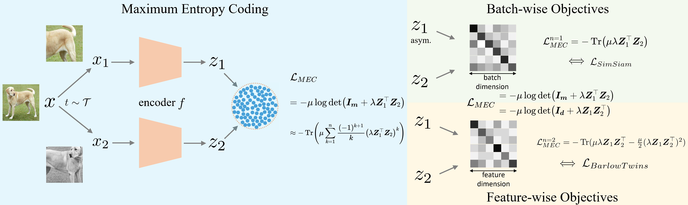

# Self-Supervised Learning via Maximum Entropy Coding
This is a PyTorch implementation of the NeurIPS 2022 paper. **[[ArXiv](https://arxiv.org/abs/2210.11464)]**

## Introduction



A mainstream type of current self-supervised learning methods pursues a general-purpose representation that can be well transferred to downstream tasks, typically by optimizing on a given pretext task such as instance discrimination. In this work, we argue that existing pretext tasks inevitably introduce biases into the learned representation, which in turn leads to biased transfer performance on various downstream tasks. To cope with this issue, we propose Maximum Entropy Coding (MEC), a more principled objective that explicitly optimizes on the structure of the representation, so that the learned representation is less biased and thus generalizes better to unseen downstream tasks. Inspired by the principle of maximum entropy in information theory, we hypothesize that a generalizable representation should be the one that admits the maximum entropy among all plausible representations. To make the objective end-to-end trainable, we propose to leverage the minimal coding length in lossy data coding as a computationally tractable surrogate for the entropy, and further derive a scalable reformulation of the objective that allows fast computation. Extensive experiments demonstrate that MEC learns a more generalizable representation than previous methods based on specific pretext tasks. It achieves state-of-the-art performance consistently on various downstream tasks, including not only ImageNet linear probe, but also semi-supervised classification, object detection, instance segmentation, and object tracking. Interestingly, we show that existing batch-wise and feature-wise self-supervised objectives could be seen equivalent to low-order approximations of MEC.


## Installation

We perform self-supervised pre-training using the proposed MEC method on [ImageNet ILSVRC-2012 dataset](https://www.image-net.org/challenges/LSVRC/2012/). Please prepare the dataset accordingly. This codebase is tested in the following environments and should also be compatible for later versions.

* Ubuntu 20.04
* Python 3.7
* [PyTorch](https://pytorch.org) 1.7.1
* [Torchvision](https://pytorch.org)  0.8.2 
* cudatoolkit 10.2


## Pretraining

To do self-supervised pre-training of a ResNet-50 model for 100 epochs using an 8-gpu machine, simply run:

```bash
$ cd MEC
$ bash pretrain.sh
```
or
```bash
$ python main_pretrain.py \
  -a resnet50 \
  --dist-url 'tcp://localhost:10501' --multiprocessing-distributed --world-size 1 --rank 0 \
  /path/to/imagenet/dataset/
```

## Linear Probing

To evaluate the pre-trained models by linear probing, simply run:

```bash
$ cd MEC/benchmarks/linearprob
$ bash linear.sh
```
or
```bash
$ python main_lincls.py \
  -a resnet50 \
  --dist-url 'tcp://localhost:10051' --multiprocessing-distributed --world-size 1 --rank 0 \
  --pretrained /path/to/pretrained/checkpoint \
  --lars \
  /path/to/imagenet/dataset
```

## Models and Logs

We provide the 100-epoch pretrained ResNet-50 model and the corresponding logs below. This model produces slightly better linear probing results than the reported results in the paper. More pretrained models and other benchmark results will be uploaded soon.
<table><tbody>
<!-- START TABLE -->
<!-- TABLE HEADER -->
<th valign="bottom">pretrain<br/>epochs</th>
<th valign="bottom">pretrained<br/>model</th>
<th valign="bottom">pretrain<br/>log</th>
<th valign="bottom">linear cls.<br/>model</th>
<th valign="bottom">linear cls.<br/>log</th>
<th valign="center">top-1 acc.</th>
<!-- TABLE BODY -->
<tr>
<td align="center">100</td>
<td align="center"><a href="https://drive.google.com/file/d/1h6AeK5_yOpvgzAmD5Otl_5ImK3go_HZa/view?usp=sharing">link</a></td>
<td align="center"><a href="https://drive.google.com/file/d/1QbMe-7CkLhXDDOskEvQP7blblafk5qko/view?usp=sharing">link</a></td>
<td align="center"><a href="https://drive.google.com/file/d/1t7RFzA4w-M9mLmwRjCi_yicTH0i7mysh/view?usp=sharing">link</a></td>
<td align="center"><a href="https://drive.google.com/file/d/1UrcdhSMoY1SUwdykLib5rd6ux7qpdTst/view?usp=sharing">link</a></td>
<td align="center">70.8</td>
</tr>
</tr>
</tbody></table>


## MMSelfSup

For those who are interested in [MMSelfSup](https://github.com/open-mmlab/mmselfsup), a re-implementation of the proposed MEC method based on this platform will be released soon.


## Acknowledgement

This repo is mainly based on [SimSiam](https://github.com/facebookresearch/simsiam) and shares the same spirit that aims to make minimal modifications on [the official PyTorch ImageNet training code](https://github.com/pytorch/examples/tree/master/imagenet). Many thanks to their wonderful work!


## Citation

```
@inproceedings{
liu2022selfsupervised,
title={Self-Supervised Learning via Maximum Entropy Coding},
author={Xin Liu and Zhongdao Wang and Ya-Li Li and Shengjin Wang},
booktitle={Advances in Neural Information Processing Systems},
editor={Alice H. Oh and Alekh Agarwal and Danielle Belgrave and Kyunghyun Cho},
year={2022},
url={https://openreview.net/forum?id=nJt27NQffr}
}
```
If you have any questions or suggestions about this work, please feel free to contact me via xinliu20@mails.tsinghua.edu.cn


